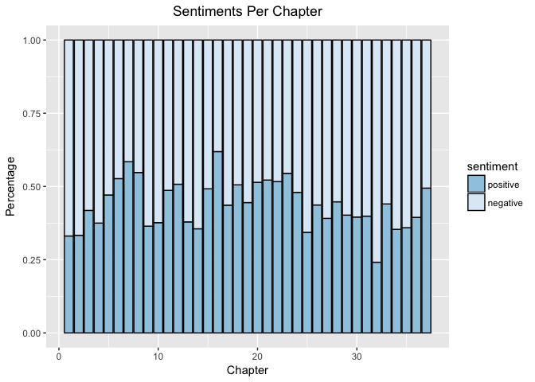
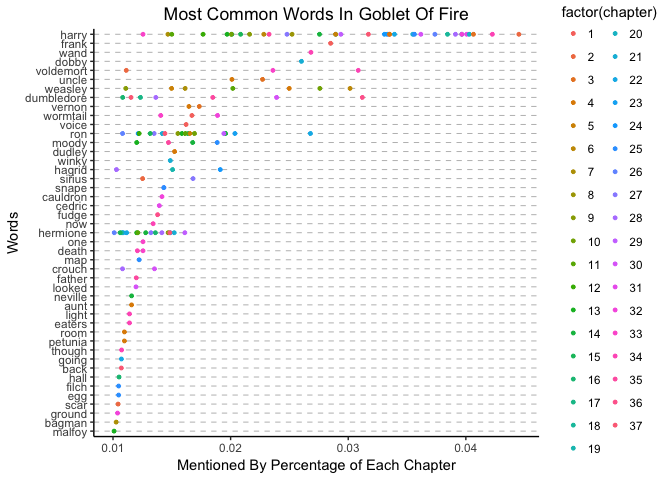
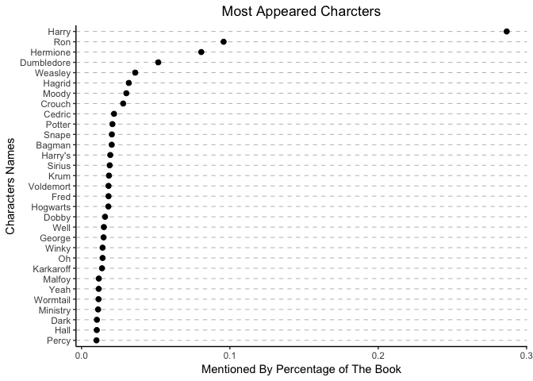
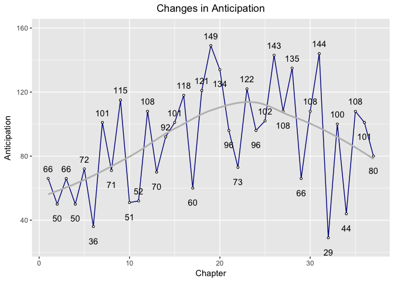
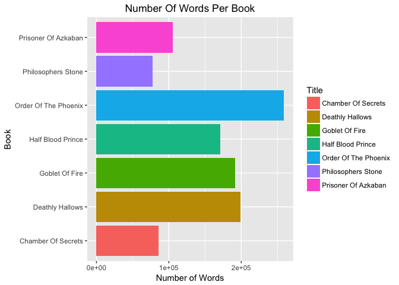
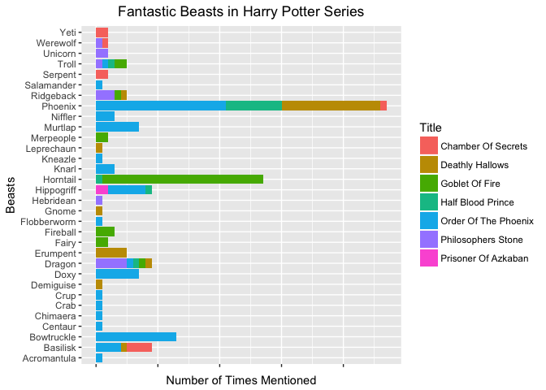

Harry Potter Analysis
================

Timelines and Task
==================

We will spend the next 2 weeks working on analyzing textual data in R. You will do the following:

-   Start with some text based data.
-   Clean data and prepare it for analysis
-   Ask questions about the data
-   Answer these questions with the data using tables and graphics
-   Each group member must have their own unique question that they code the answer for.

Overview
========

Harry Potter text analysis to answer the following questions:

1.  How does the sentiment change across the entire book?
2.  What are the most common words by chapter?
3.  Which characters appear the most?
4.  How does the emotion anticipation change throughout the book?
5.  What is the word count for each book?
6.  Individual Question: How many beasts in the Fantastic Beasts book were mentioned in all the Harry Potter books?

Question 1: How does the sentiment change across the entire book?
-----------------------------------------------------------------

In the pre-class assignments, we performed sentiment analysis using text analysis methods. The following sentiment analysis is applied to Goblet Of Fire:

It seems like more the of the chapters seems to be on the "negative" side.

Question 2: What are the most common words by chapter?
------------------------------------------------------

The most common words in Goblet Of Fire. The graph only contains words that that up 1% or more words per chapter.

As expected, "harry" is mentioned the most in the book. Surprisingly, though, "Voldemort" is also mentioned quite a few times. Perhaps he isn't the one who shall not be named?

Question 3: Which characters appear the most?
---------------------------------------------

Similiarly, we can find the most popular characters in the book: 

Of course, Harry, Ron and Hermione are the top three characters in the book.

Question 4: How does the emotion anticipation change throughout the book?
-------------------------------------------------------------------------

Rather than looking at emotional differences in each chapter, we look at the anticipation trend throughout the book.

Anticipation peaked at around Chapter 24.

Question 5: What is the word count for each book?
-------------------------------------------------

Order Of The Pheonix, Deathly Hallows and Half Blood Prince are the wordiest books in the Harry Potter series.

Question 6: Individual Question: How many beasts in the Fantastic Beasts book were mentioned in all the Harry Potter books?
---------------------------------------------------------------------------------------------------------------------------

Fantastic Beasts and Where To Find Them is a guide of beasts in the Harry Potter world. As expected, some of the beasts in the guide would be mentioned in the Harry Potter book series. But how many of them are mentioned and how many of them are mentioned in each book? The above graph shows a list of beasts mentioned in the books, indexed by book. For example, "Phoenix" is mentioned the most in The Order Of The Phoenix; "Horntail" is mentioned the most in Goblet Of Fire.
