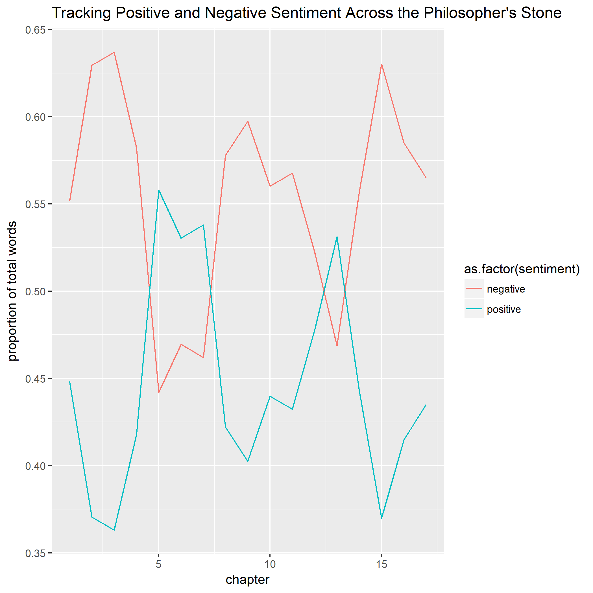

# Sentiment Analysis In the Philosopher's Stone

## Question 1 : I want to first start by looking at the sentiment content in the very first book that she wrote : Philosophers stone

load('Joyce Elias/clean data/books.rda')

```{r}
load('/clean data/books.rda')

library(dplyr)
library(tidytext)
library(tidytext)
library(stringr)
library(ggplot2)


book_one_count=
books %>%
filter(title== "philosophers_stone" ) %>%  # Just looking at the rows which contain Philsopher's stone
  inner_join(get_sentiments("bing")) %>%  # we are using the bing lexicon to examine sentiment
  group_by(chapter,sentiment) %>% # I want to group by chapter and by sentiment ( positive or negative)
dplyr::  count(chapter,sentiment)  #I want to the count the sentiment based on chapter

sentiment_prop<-  
  book_one_count %>%
  group_by(chapter) %>%
   mutate(total_words=sum(n),prop=n/total_words)  # what proportion of the total words are positive and negative in each chapter
  
    ggplot(sentiment_prop, aes(x = chapter, y = prop, col = as.factor(sentiment))) +
  geom_line()+   # plotting the sentiment over each chapter in the book
   ggtitle("Tracking Positive and Negative Sentiment Across the Philosopher's Stone") +
      labs(y="proportion of total words")
```
### Question 1b : I can also use a different lexicon that assigns a score rather than saying positive and negative. Affin lexicon 

```{r}
affin_lex<-
  books %>%
  filter(title=="philosophers_stone")%>%
  inner_join(get_sentiments("afinn"))%>%  # This lexicon assigns a score from -5 to +5 based on negative and positive 
  group_by(chapter) %>%
  summarize(total_score=sum(score)) # what is the total score for each chapter. Do some chapters tend to be more positive than negative

  
 ggplot(affin_lex, aes(x = chapter, y = total_score)) +
  geom_line(col="blue1")+   # plotting the sentiment over each chapter in the book based on score
   geom_hline(aes(yintercept=0),color="darkorchid4",linetype="dashed")+
   ggtitle("Tracking Sentiment Across The Philosopher's Stone") +
   labs(y="score")
```
It can be seen here that JK rowling changes the sentiment's of her chapters quickly. This would make sense, seeing as the books are known for being emotion inducing. It can be seen that from the onset, JK rowling's language quickly becomes negative as she sets up the books, and then works on building up positive sentiments towards the middle of the book . However, as can be seen, the sentiment takes a nose dive in chapter 15, perhaps indicating the book ends on an uncertain/ negative note.

### Question 2: For this part I want to see the most common words of the whole book and then the most common words by chapter.
```{r} 
philosophers_stone<-
books %>%
  filter(title=="philosophers_stone") 

nrc_lex<-philosophers_stone %>%
  inner_join(get_sentiments("nrc"))
  
```
```{r}
nrc_lex %>%
  group_by(chapter,word) %>%
  count(word,sort=TRUE)%>%
  top_n(2) %>%  # Since I grouped the data by chapter, top_n lets me see the top x # of words for each chapter. For example top_n(5) means I will see the top 5 words in each chapter. 

ggplot(aes(x=reorder(word,n),y=n,fill=chapter))+
  geom_col(stat="identity",fill="coral1")+
  ggtitle("Most Common Words in the Philosopher's Stone")+
  labs(y="count")+
  coord_flip()
```
# Question 2b : I can also look at this based on every chapter
```{r}

 nrc_lex %>%
  group_by(chapter) %>%  # i grouped it by sentiment
  count(word)%>% # I count the number of times the word appears in the book
  top_n(10)%>%  # I then select the top 10 words for each sentiment
 
  
  ggplot(aes(x=reorder(word,n), y=n,fill=chapter))+ # I am making a plot that fills in the bar with the sentiment
  geom_col(show.legend=FALSE)+ # this makes columns and excludes the legend
  ggtitle("Top Ten Words in Each Chapter of The Philosopher's Stone")+
  labs(y="count")+
  facet_wrap(~chapter,scales="free")+ # this feature tells R to make this graph for each sentiment
  coord_flip() # flip the x and y axis
``` 
### Question 3 :Next I would like to look at the most popular characters in the first harry potter book.
```{r}
## help was provided from Isaac
library(rebus)
library(tidytext)
characters<-
  philosophers_stone%>%
  select(word) %>%
  filter(str_detect(word,UPPER %R% ANY_CHAR %R% ANY_CHAR %R% ANY_CHAR)) %>%
  filter(!word %in% c( "The","They","What","There","It's","Then")) %>%
  group_by(word) %>%
  summarise(count=n()) %>%
  top_n(10)
  
ggplot(characters,aes(x=word,y=count))+
  geom_col(fill="salmon") +
  ggtitle("Most Popular Characters in the Philosopher's Stone") +
  labs(x="Characters") +
  geom_text(aes(label=paste0(count)),nudge_y=1) +
  coord_flip()


  
```

### Question 4 :For this next part I would like to see how the anticipation changes throughout the book. JK rowling is known for how she strings the reader along and how she infuses anxiety into her text. We will examine this here using the NRC lexicon 

```{r}
nrc_look=
books %>%
  filter(title=="philosophers_stone") %>%
  inner_join(get_sentiments("nrc")) %>%
  filter(sentiment=="anticipation")%>%
group_by(chapter) %>%
  count(sentiment)

ggplot(nrc_look,aes(x=chapter, y=n))+ 
  geom_col(stat="identity",fill="gold3")+
  ggtitle("The number of Anticipation words by Chapter")+
  labs(y="count")


```
### Question 4b:Another way of tracking anticipation would be to look at the proportion of words which have an anticipation sentiment rather than looking at the raw usage of the words :
```{r}
total_words=
books %>%
  filter(title=="philosophers_stone") %>%
  inner_join(get_sentiments("nrc"))%>%
  group_by(chapter,sentiment) %>%
  count(word) %>%
  summarise(word_occurence=sum(n))%>%
mutate(total_words=sum(word_occurence)) %>%

  filter(sentiment=="anticipation") %>%
  mutate(proportion= word_occurence/total_words) 


ggplot(total_words,aes(x=chapter,y=proportion))+
  geom_line(col="deeppink3")+
  ggtitle("Tracking the Anticipation sentiment in Philosopher's Stone")+
  labs(y="Proportion of Anticipation Words")

  
```

It appears that JK rowling really takes the reader for a ride emotionally with her first book. Notice the proportion of words that have an anticipation sentiment rise and fall quite sharply from chapter to chapter.

## My Personal Analysis :
For my own personal analysis I want to look at a variety of aspects in the first harry potter book. I want to start by looking at the top 10 words in each sentiment across the entire book

## Question 5
```{r}
nrc_lex %>%
  group_by(sentiment) %>%  # i grouped it by sentiment
  count(word)%>% # I count the number of times the word appears in the book
  top_n(10)%>%  # I then select the top 10 words for each sentiment
 
  
  ggplot(aes(word,n,fill=sentiment))+ # I am making a plot that fills in the bar with the sentiment
  geom_col(show.legend=FALSE)+ # this makes columns and excludes the legend
  facet_wrap(~sentiment,scales="free")+ # this feature tells R to make this graph for each sentiment
   ggtitle("Word Contribution by Sentiment")+
  coord_flip()+ # flip the x and y axis
 labs(y="count")
```

### Question 6 I would like to see the contribution that each sentiment makes based on the afinn lexicon.
```{r}
sentiment_contribution<-
philosophers_stone %>%
  count(chapter,word) %>% # counts the number of items a specific word appears in the chapter
  inner_join(get_sentiments("afinn")) %>%  # inner_join with the afinn lexicon which assigns a score based on how positive or negative the word is
  group_by(chapter)%>%
  mutate(contribution = (score*n)/sum(n)) %>%  # this essentially weights each word by the number of times it appears
  top_n(10)%>%
  ungroup%>%
   mutate(word = reorder(word, n))

ggplot(sentiment_contribution,aes(x=word,y=contribution))+
  geom_col(show.legend=FALSE,fill="darkseagreen2") +
  facet_wrap(~chapter,scales="free")+  # I facet wrapped based on chapter so I could see the top 10 words in each chapter and the corresponding contribution
  coord_flip()
```


