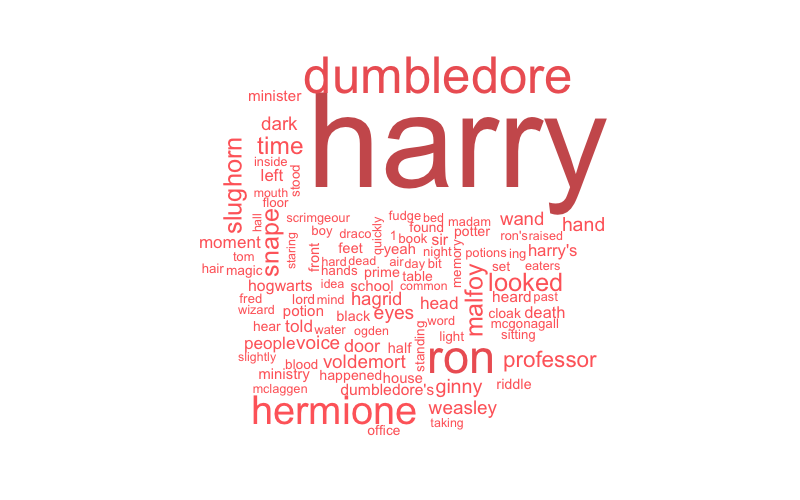

## Background 

Harry Potter is a series of fantasy novels written by British author J. K. Rowling. The novels chronicle the life of a young wizard, Harry Potter, and his friends Hermione Granger and Ron Weasley, all of whom are students at Hogwarts School of Witchcraft and Wizardry. The main story arc concerns Harry's struggle against Lord Voldemort, a dark wizard who intends to become immortal, overthrow the wizard governing body known as the Ministry of Magic, and subjugate all wizards and muggles, a reference term that means non-magical people.

This is just a simple report on some of the basic statistics for the 6th book in the series, Harry Potter and the Half-Blood Prince. 

## The Data

The data used in this report is from the R package, Harry Potter Book Series. 


## Basic Information
1. The graph below depicts the most important 100 keywords in Harry Potter and The Half-Blood Prince. By knowking the keywords in this book, we can have a basic idea of the content of this book and the relatively important words. 


2. Harry Potter and Half-Blood Prince has a total of 171,284 words. The table below displays the most common words in each chapter. By knowing that, we can have a basic idea of the important charcaters or items in each chapter in order to get to know the story frame. 

```{r, echo=FALSE}
load("data/modifieddata/HP6Top.Rda")
knitr::kable(Book6Word)
```

3. There are many characters in this book. And the graph below depicts the main characters and their frequencies in this book. 


## More Analysis
4. The graph below depicts the sentiment changes along the chapter in this book. From the graph, we can see there is clear difference between the sentiments in different chapters. The sentiment becomes more positive in chapter 1 to 10. Then it becomes negative from chapters 10 to 15. Then the sentiment becomes positive again from chapter 15 to 22. The it becomes more and more negative from chapter 22 to the end. 


5. Among all the emotions, we can try to analyze the change of one specific emotion "anticipation". 


6. To make further analysis, we can try to examine bigrams in this book. After cleaning the data, the following table gives the most popular bigrams in each chapter. From the table, we can see the most important keywords in every chapter in order to know the story outline. 

```{r, echo=FALSE}
load("data/modifieddata/HP6topbi.Rda")
knitr::kable(Book6TopBi)
```


